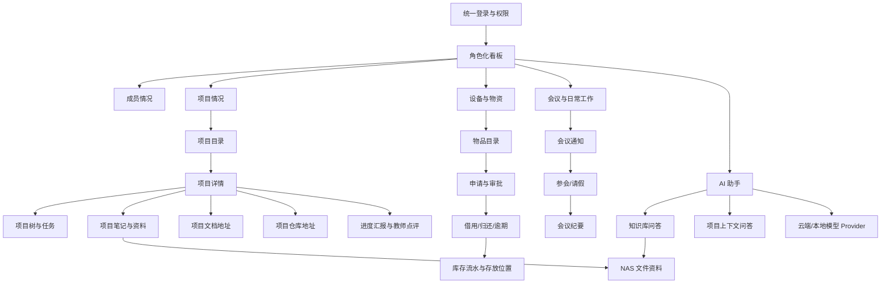
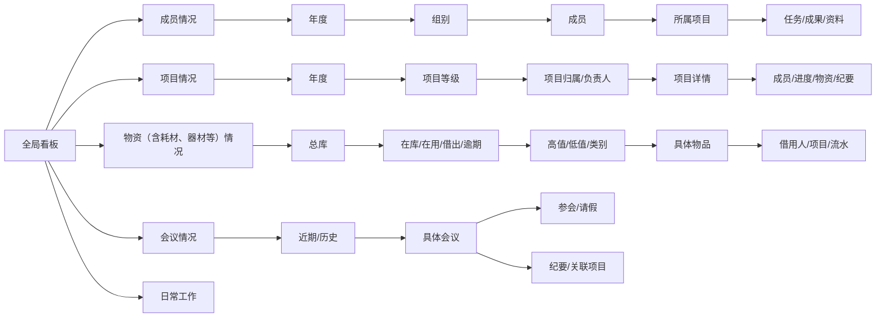
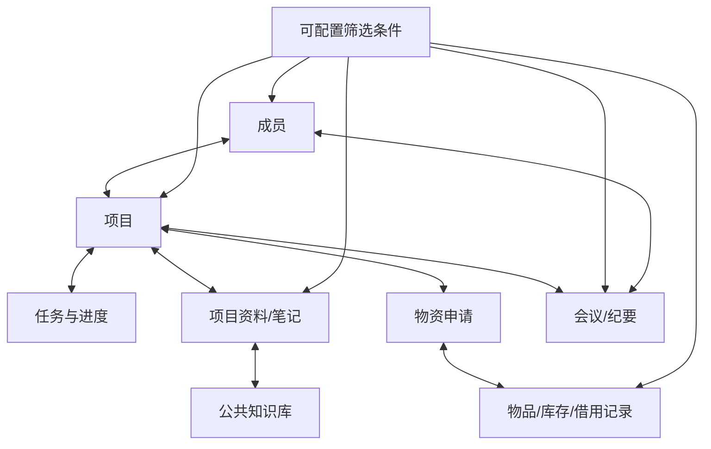
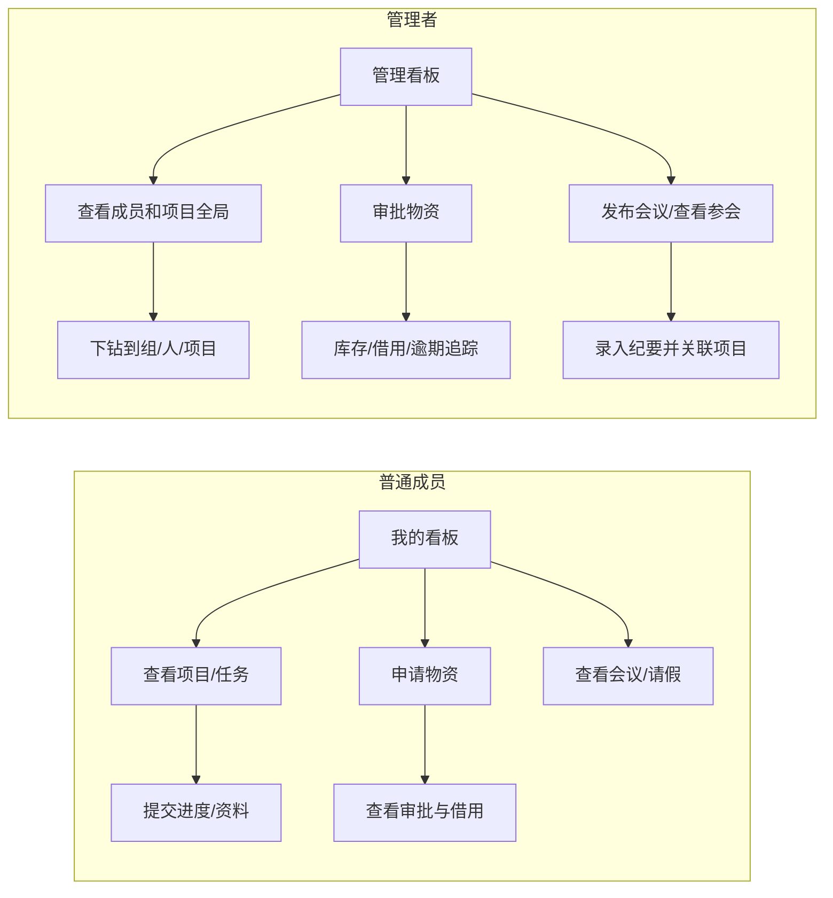

# 功能示意图

面向：老师评审、产品讨论、开发联调  
整理日期：2026-07-12  
说明：图示采用 Mermaid 编写，可在支持 Mermaid 的 Markdown 工具中直接渲染；如果 NAS 预览不渲染，可按图中结构转换为 PNG/PDF。

## 1. 平台整体功能结构

## 2. 管理者多级下钻示意图

## 3. 横向交叉查询示意图

示例：从成员进入可以查看所属组、参与项目、任务、资料和物资申请；从项目进入可以反查成员、任务进度、资料、会议纪要和物资申请；从物资借用记录进入可以反查借用人、所属组、关联项目和库存流水。

## 4. 普通成员和管理者流程对比

## 5. 使用与变更规则

- 图示是需求说明，不代表所有功能已经实现。
- v1.0 优先实现图中的 P0 主链路；动态字段和新增一级目录通过插件/配置扩展。
- 图示每次变更必须同步正式需求文档、功能蓝图和周会进度。
- 上传 NAS 时建议与本文件一同上传教师评审包中的 README、正式需求、目标架构和 v1 开发计划。
