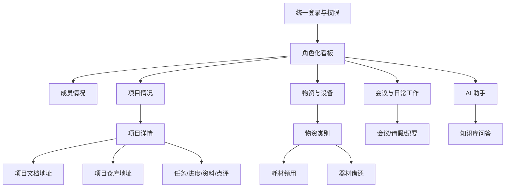
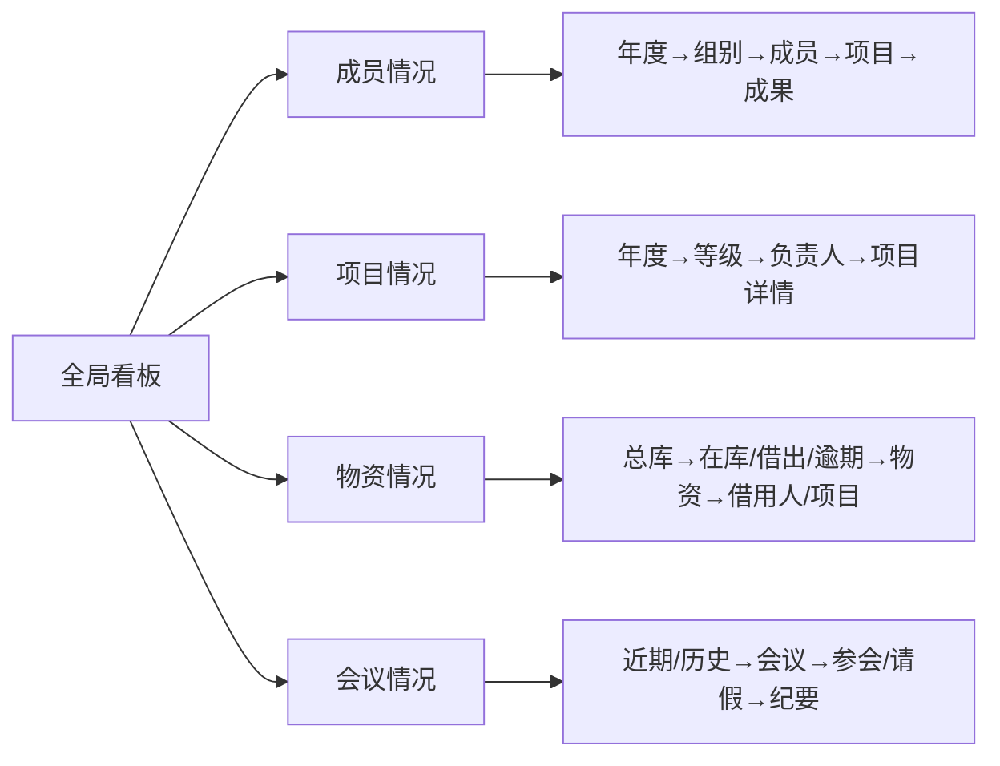
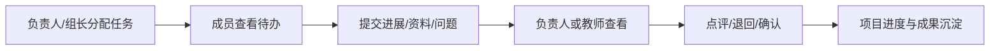

# 功能示意图

## 1. 平台功能结构

```mermaid
flowchart TD
    A[统一登录与权限] --> B[角色化看板]
    B --> C[成员情况]
    B --> D[项目情况]
    B --> E[物资与设备]
    B --> F[会议与日常工作]
    B --> G[AI 助手]
    D --> D1[项目详情]
    D1 --> D2[项目文档地址]
    D1 --> D3[项目仓库地址]
    D1 --> D4[任务/进度/资料/点评]
    E --> E1[物资类别]
    E1 --> E2[耗材领用]
    E1 --> E3[器材借还]
    F --> F1[会议/请假/纪要]
    G --> G1[知识库问答]
```

## 2. 管理者下钻

```mermaid
flowchart LR
    A[全局看板] --> B[成员情况]
    A --> C[项目情况]
    A --> D[物资情况]
    A --> E[会议情况]
    B --> B1[年度→组别→成员→项目→成果]
    C --> C1[年度→等级→负责人→项目详情]
    D --> D1[总库→在库/借出/逾期→物资→借用人/项目]
    E --> E1[近期/历史→会议→参会/请假→纪要]
```

## 3. 项目协作闭环

```mermaid
flowchart LR
    A[负责人/组长分配任务] --> B[成员查看待办]
    B --> C[提交进展/资料/问题]
    C --> D[负责人或教师查看]
    D --> E[点评/退回/确认]
    E --> F[项目进度与成果沉淀]
```

图示说明：卡片、筛选维度、字段和一级目录都应允许插件或配置扩展；图中未表示的工资/经费、场地、存储柜属于待确认或后续资源模块。
